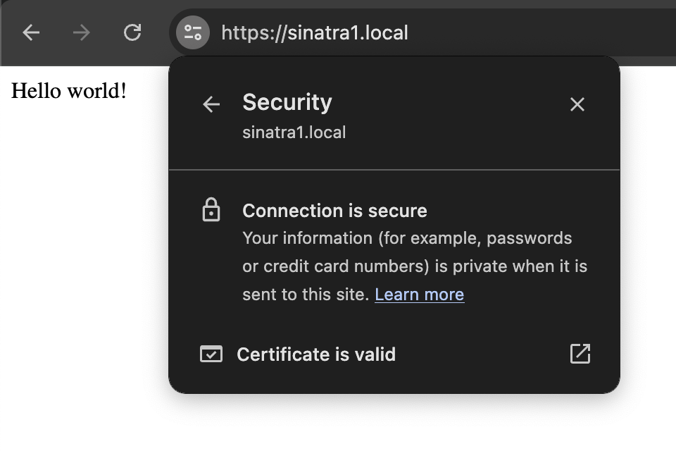

# Lokal Ruby

Ruby Gem for interacting with Lokal Client REST API.




## Installation

```ruby
gem 'lokal', '~> 0.0.1'
```

or install globally

```sh
gem install lokal
```

## Example Usage

```ruby
require 'lokal'

client = Lokal::Client.new
tunnel = client.new_tunnel
           .set_name("my-tunnel")
           .set_tunnel_type("HTTP")
           .set_local_address("localhost:3000")
           # self-hosted tunnel server with domain k.lokal-so.site must be exist or using Lokal Cloud
           .set_public_address("mybackend551.k.lokal-so.site")
           .set_lan_address("my-app2.local")
           .show_startup_banner

tunnel.create
```
